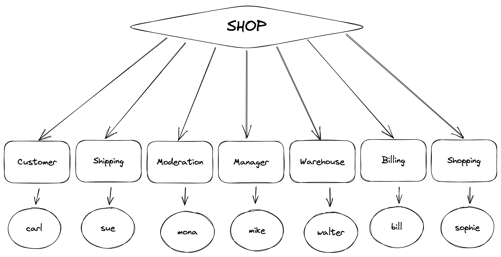

# Project

This project defines a business process model of a fictional online shop company. It is developed within the scope of the subject "Operational Information Systems" at Hochschule Kaiserslautern.

## Organization Structure

The following users are defined:
- carl: A customer
- bill: Billing department
- sue: Shipping department
- walter: Warehouse department
- mike: Management department
- mona: Shop moderation

> **Note:** The passwords for all users are `123`.